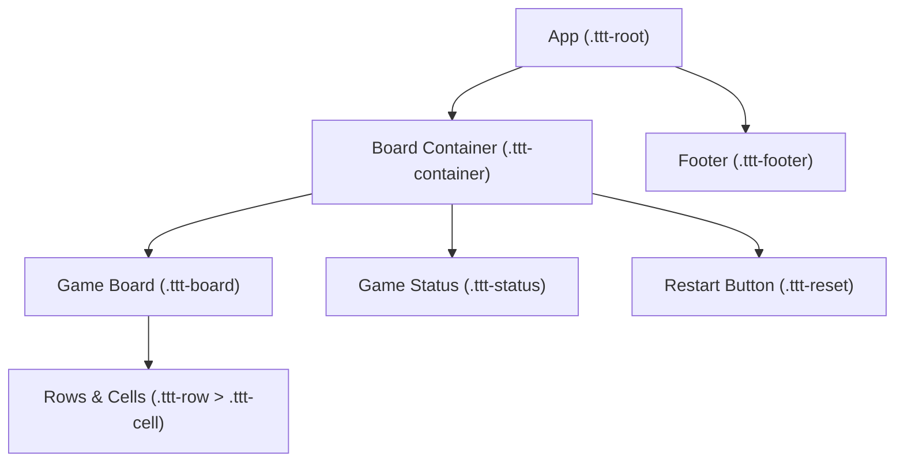

# Tic Tac Toe Frontend - Architectural Overview

## Overview

This document provides an architectural overview, diagrams, and insights into the structure, key components, and architectural decisions behind the Tic Tac Toe frontend implemented in React. The application aims for minimalism, clarity, and a strong separation of UI, game logic, and style, with a single React functional component managing all gameplay and visuals.

---

## Key Architectural Decisions

- **Minimal React Structure:** The application is built around a single main component (`App`) in `src/App.js`. This decision keeps the codebase extremely lightweight and easy to follow.
- **No External UI Libraries:** Styling relies only on vanilla CSS for performance and customization, located in `src/App.css` and `src/index.css`.
- **Single-State Management:** All relevant game state (board, player turn, winner, draw state) is managed using React's `useState` and `useEffect` hooks.
- **Self-contained Game Logic:** Functions for win detection and managing state are co-located with the main UI logic, facilitating clarity and maintainability for this small project scope.
- **Testing Included:** The codebase includes front-end tests using React Testing Library (`App.test.js`).

---

## File/Folder Structure

```
tic_tac_toe_frontend/
│
├── README.md                          # Project overview and setup
├── eslint.config.mjs                  # ESLint configuration for code quality
├── package.json                       # NPM dependencies and scripts
├── post_process_status.lock           
└── src/
    ├── App.js                         # Main React component, contains all game logic and UI
    ├── App.css                        # Custom CSS for component appearance (board, cells, status, etc.)
    ├── App.test.js                    # Tests for main App component
    ├── index.js                       # Entry point; renders <App /> to DOM
    ├── index.css                      # Generic CSS resets and global styles
    └── setupTests.js                  # Jest-DOM setup for testing
```

---

## Main Component/Modules

### 1. `App.js` (`src/App.js`)

- **Type:** React Functional Component
- **Responsibilities:**  
  - Renders the main layout and controls of the application.
  - Manages all game state: board state, player turns, winner/draw tracking.
  - Contains game logic for move handling, win/draw detection, and resetting the game.
  - Handles UI updates (highlighting winner, footer/status changes).

#### Key State Variables

- `board`: an array of 9 representing the Tic Tac Toe cells.
- `isXNext`: boolean, true if player X's turn, false otherwise.
- `winner`: either `'X'`, `'O'`, or `null`.
- `isDraw`: boolean indicating if the game is drawn.

#### Key Functions

- `handleCellClick(idx)`: Handles a user clicking a cell (places an X or O and updates turn/win/draw state).
- `restartGame()`: Resets the board to start a new game.
- `calculateWinner(squares)`: Determines if there is a winner.
- `getWinnerLine(squares)`: Returns the winning line for cell highlighting.

#### UI/UX Decisions

- **Board Layout:** Simple center layout with a 3x3 grid.
- **Player Feedback:** Header displays whose turn it is, or announces winner/draw.
- **Highlighting:** Winning cells are visually highlighted.
- **Reset:** Button to restart game, accessible and visually distinct.

### 2. CSS (`src/App.css`, `src/index.css`)

- Custom properties are used for theme colors (primary, secondary, accent colors).
- Styles defined for board, cells, buttons, status, responsive layout.
- No 3rd-party framework dependencies for styling.

### 3. Testing (`src/App.test.js`, `setupTests.js`)

- Uses React Testing Library for basic interaction testing.
- Tests:
    - Ensures board renders and allows moves.
    - Ensures the reset button clears the board.

---

## Diagram: Component Structure

```mermaid
flowchart TD
    A[App (src/App.js)]
    style A fill:#E3F2FD,stroke:#1976D2,stroke-width:2px
    subgraph "Rendered in"
        B["index.js<br/>ReactDOM.createRoot"]
    end
    A --> |"Renders"| C["Game Board (3x3 buttons)"]
    A --> |"Shows"| D["Game Status<br/>(whose turn, winner, draw)"]
    A --> |"Renders"| E["Restart Button"]
    A --> |"Displays"| F["Footer"]

    B --> A

    subgraph Styles
        G["App.css"]
        H["index.css"]
    end
    A -.-> G
    B -.-> H
```

---

## Diagram: Tic Tac Toe UI Breakdown



---

## Summary

- The Tic Tac Toe frontend is intentionally kept simple for maintainability and transparency.
- All gameplay and user interface are managed within a single React component.
- The file structure mirrors common React project conventions but is simplified for this small game.
- All styling is accomplished through local CSS files without external frameworks.
- Test coverage ensures that key user flows (playing and restarting a game) are functional.

---

## References

- See `src/App.js` for source of all game logic and UI code.
- Styles/theme definitions are in `src/App.css`.
- Basic user flow tests are in `src/App.test.js`.

